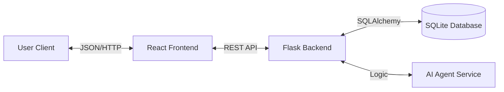

# AI Task Manager

**A Production-Quality, AI-Enhanced Task Management System.**

## 1. Project Overview :

The **AI Task Manager** is a full-stack application designed to streamline task organization through intelligent automation. Unlike traditional to-do lists, this application leverages a simulated AI agent to automatically categorize tasks based on their content, reducing cognitive load for the user.

Key goals of this project:
- **Clean Architecture:** Demonstrating separation of concerns between frontend and backend.
- **Robustness:** Strict input validation, comprehensive error handling, and automated testing.
- **Simplicity:** A minimalist, distraction-free user interface.

## 2. Technology Stack

### Backend (Python)
- **Framework:** **Flask** (Lightweight, flexible WSGI web application framework).
- **Database:** **SQLite** with **SQLAlchemy ORM** (Zero-configuration relational database).
- **Validation:** **Marshmallow** (Object serialization and deserialization library).
- **Testing:** **Pytest** (Scalable testing framework).

### Frontend (JavaScript)
- **Library:** **React 18** (Declarative, component-based UI library).
- **Paradigm:** Functional Components with Hooks (`useState`, `useEffect`).
- **Communication:** Native **Fetch API** (No external Axios dependency to reduce bundle size).
- **Styling:** Vanilla CSS (For maximum control and zero build-overhead).

## 3. Architecture

The application follows a **ESTful API Architectur**.



- **Frontend:** A Single Page Application (SPA) that consumes the API. It manages local state and handles user interactions.
- **Backend:** A stateless REST API that exposes resources (`/tasks`) and handles business logic.
- **Data Layer:** A relational database storing tasks with strict schema enforcement.

## 4. Design Decisions

### Why Flask over Django?
We chose Flask for its **micro-framework nature**. For a focused application like this, Django's batteries-included approach (built-in auth, admin panel) would introduce unnecessary bloat. Flask allows us to explicitly define our architecture and dependencies, leading to a leaner codebase.

### Why Rule-Based AI?
The "AI" categorization currently uses a deterministic keyword-matching algorithm.
- **Reasoning:** This simulates the *interface* and *utility* of an LLM without the latency, cost, or API key requirements of a real model (like GPT-4). It ensures the application is playable and testable offline.
- **Scalability:** The system is designed so this module can be swapped for a real Machine Learning model with zero changes to the frontend or database schema.

### Why SQLite?
SQLite provides a full SQL engine without the need for a separate server process (like PostgreSQL or MySQL). This makes the application thoroughly portable and easy to run locally.

## 5. AI Usage Explanation

The application features an **Auto-Categorization Agent**.
When a user requests categorization for a task, the backend analyzes the `title` and `description` fields.

**Logic:**
- **Study**: Triggered by keywords like "study", "learn", "course".
- **Personal**: Triggered by "buy", "groceries", "home".
- **Work**: Triggered by "build", "code", "deploy", "meeting".
- **General**: Fallback for ambiguous content.

This logic is encapsulated in `backend/utils.py`, adhering to the Single Responsibility Principle.

## 6. How to Run

### Prerequisites
- Python 3.8+
- Node.js 14+
- Git

### Backend Setup

1.  **Clone the repository:**
    ```bash
    git clone https://github.com/Arnazz10/AI-Task-Manager.git
    cd AI-Task-Manager/backend
    ```

2.  **Create virtual environment:**
    ```bash
    python3 -m venv venv
    source venv/bin/activate  # On Windows: venv\Scripts\activate
    ```

3.  **Install dependencies:**
    ```bash
    pip install -r requirements.txt
    ```

4.  **Run the server:**
    ```bash
    python app.py
    ```
    The API will start at `http://localhost:5000`.

### Frontend Setup

1.  **Navigate to frontend directory:**
    ```bash
    cd ../frontend
    ```

2.  **Install dependencies:**
    ```bash
    npm install
    ```

3.  **Start the development server:**
    ```bash
    npm start
    ```
    The application will open at `http://localhost:3000`.

## 7. Future Improvements

- **LLM Integration:** Replace keyword matching with OpenAI API or local LLM (Llama 3) for semantic understanding.
- **Authentication:** Implement JWT-based user accounts.
- **Priority Scheduling:** AI-driven suggestion for task due dates.
- **Drill-down Analytics:** Visual charts of completed tasks by category.
